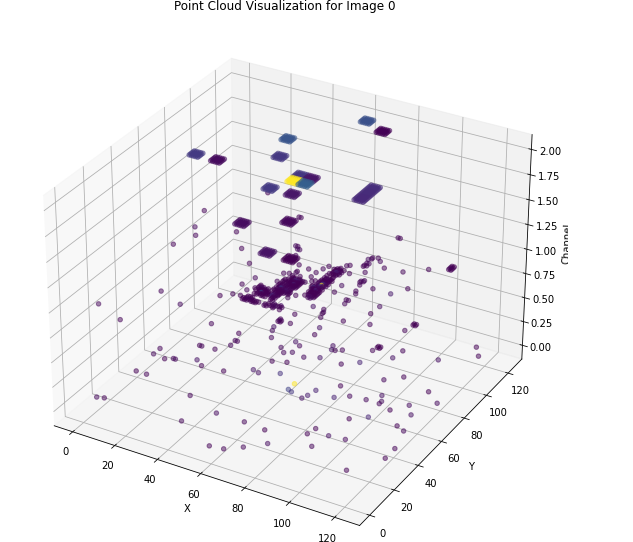

# ML4SCI DeepFalcon & Genie Tasks

This repository contains evaluation Common Task 2 listed in Deepfalcon [here](https://docs.google.com/document/d/1bwRaHc0IYIcFOokMcW-mYJv2i24iP1mm08ALTSyQ4EI/edit#) and Genie [here](https://docs.google.com/document/d/10C8mNjE-WE6OuESjcnuJ_N430D-Hdtz-4_lLxGMnKbI/edit#)

Common Task 1: https://github.com/Akshit17/Variational-Autoencoder-for-Quark-Gluon-Jet-Event-Images   [](https://colab.research.google.com/drive/1U0GpBILJBN41ycrfjwszWSsDEfZowT6z?usp=share_link)

Common Task 2:  https://github.com/Akshit17/GNN-based-classification   [](https://colab.research.google.com/drive/1CNLgeSXUhHWAxsWbIoOkXcg2F5MyR8E7?usp=share_link)

Specific Task 2: https://github.com/Akshit17/Diffusion-model-for-Quark-Gluon-Jet-images    [](https://colab.research.google.com/drive/1yguDl8tepWsCyd-PxZYjCf7msVMrzfJx?usp=share_link)

Applying for :- **“Diffusion Models for Fast Detector Simulation”** and **"Learning the Latent Structure with Diffusion Models"** project

---
## Quark/Gluon jet classification

Quark/Gluon jet classification problem involves distinguishing between jets that are initiated by quarks and those that are initiated by gluons. This problem is important for understanding the properties of the strong force and for improving our understanding of particle physics. 

For this task Graph Neural Network (GNN)  were used to classify the jets. Specifically, a GraphSAGE model, which is capable of aggregating information from the local neighborhood of each node in the graph. GraphSAGE is computationally efficient due to its use of neighborhood aggregation because of which it is also able to handle noisy and missing data by message passing information from neighboring nodes. It has demonstrated state-of-the-art performance on a variety of graph-related tasks which suggested it maybe a strong choice for q/g jet classification as well.


---
## Dataset
[Dataset](https://drive.google.com/file/d/1WO2K-SfU2dntGU4Bb3IYBp9Rh7rtTYEr/view?usp=sharing) given consists of four keys X_jets(image), m0(mass), pt(transverse momentum), y(labels for quark and gluon jet). 
Each image is 125x125 consisting of three channels Track, ECAL and HCAL respectively.

#### Combined channels image sample :-


#### Point cloud visualization :-


Note :- For visualization purposes Tracks, ECAL, HCAL channels have z = 0,1,2 respectively. However when training 2D surface would be used i.e z=0 for all channels

#### Point cloud to graph representation :-
 * Extracted the non-zero pixels from each channel of the image using a mask.
 * Each image is essentially transformed into a set of nodes, where each node represents a non-zero pixel in the image. 
 * To form the edges between nodes k-nearest neighbor graph was constructed, with k=10, 4 and 2 respectively. Each node will connected to its k-nearest neighbors.
 * Node features, labels and the adjacency matrix returned by `kneighbors_graph` function from the `sklearn.neighbors` were used to create PyTorch Geometric `Data` objects that could be used as inputs later for the GraphSAGE model.


---
## Model building and training

#### Architecture :-

```
GraphLevelGNN(
  (model): GraphSAGE(
    (conv1): SAGEConv(3, 32, aggr=mean)
    (conv2): SAGEConv(32, 64, aggr=mean)
    (conv3): SAGEConv(64, 128, aggr=mean)
    (lin1): Linear(in_features=128, out_features=64, bias=True)
    (lin2): Linear(in_features=64, out_features=16, bias=True)
    (lin3): Linear(in_features=16, out_features=2, bias=True)
  )
  (loss_module): CrossEntropyLoss()
)
```
Hyperparameters :- `optimizer : Adam`, `learning rate : 1e-3`

For training the model Pytorch Lightning was used as wrapper for easy-to-use and flexible interface for defining and training the model without needing to worry about low-level implementation details.

#### Performance :-

| Model | Test Accuracy | Validation Accuracy | 
| :-------: | :----: | :----: | 
| GraphSAGE (k=10) | 0.7138 | 0.6996 | 
| GraphSAGE (k=4) | 0.7121 | 0.6962 | 
| GraphSAGE (k=2) |  0.7198 | 0.6929 | 


## Discussion

*  Differences in accuracy between the different values of `k` are relatively small, indicating that the chosen model architecture is not very sensitive to changes in the value of `k`.  (`k` is the number of nearest neighbors for each node)

* As GraphSAGE works by aggregating node features from its neighbors and generating embeddings for each node it is only able to understand the local neighborhood of each node, which may not capture the full structure of the graph. 

* Though it seems to be performing well achieving an accuracy of around 71%, alternate GNN models may also be used such as Graph Attention Networks (GATs) and Graph Convolutional Networks (GCNs) which might help addressing this issue by incorporating information from distant nodes as well. These alternate models would be susceptable to issues relating to scalability, choice of `k` and other hyperparameters.

* As GraphSAGE can be applied to large-scale graphs and is computationally efficient due to its use of neighborhood aggregation it will be well-suited if scalability is a concern. Therefore, trade-off between accuracy and computational efficiency will need to be considered when choosing a GNN model for the particular task.


